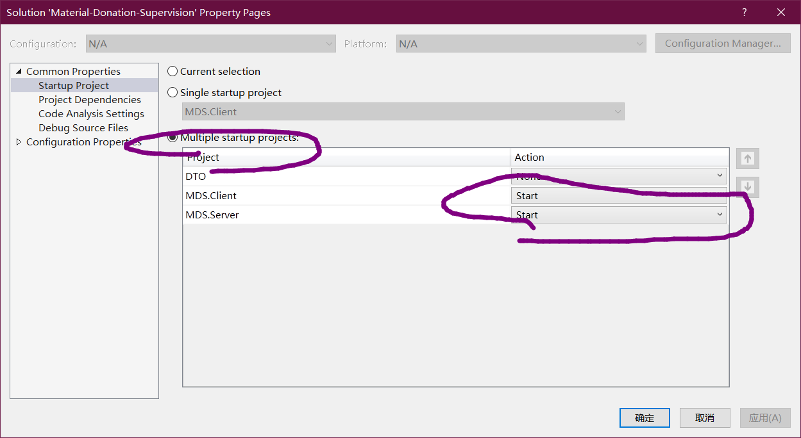
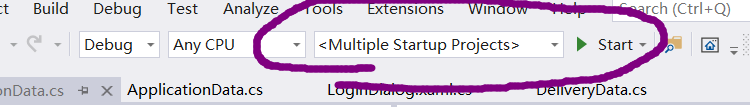

# Material-Donation-Supervision

软工文档

测试的时候，注意，VS2019可以同时开多个程序的。在解决方案的属性中使用多个startup，同时启动服务器和数据库




## 客户端

* 使用WPF框架(基于.net Core3.1，注意VS2017并不支持开发.NetCore3，请先下载VS2019)
* UI设计语言为谷歌的MaterialDesign，使用[MaterialDesignInXamlToolkit](https://github.com/MaterialDesignInXAML/MaterialDesignInXamlToolkit)和[MaterialDesignExtensions](https://github.com/spiegelp/MaterialDesignExtensions)这两个工具包来实现
    * 注意MaterialDesignExtensions的TabStepper疑似存在一些问题，在Tab中使用某些MD控件会导致渲染的时候有很多莫名其妙的格线，应该是它的BUG，请小心使用
* 客户端的报错尽量不要使用```MessageBox.Show```，UI很难看，MainWindow有一个SnackBar，用那个。注意每一个Page需要使用所在的Window的SnackBar，如果所在的Window没有SnackBar，仿照MainWindow的格式创建一个。
* 不鼓励多级Window，尽量使用Page、Tab、以及MaterialDesign库的Dialog
* 最终提交前请在Application那里catch所有未被catch的异常，防止客户端遇到异常直接崩溃。并且在MainPage中开启根据用户类型显示Tab。测试阶段可以关闭这些代码方便测试。

### 关于风格统一

尽量使用MD的控件和Style

## 网络模块

1. 关于异常处理问题，404，连不上服务器时客户端需要在```App.xaml.cs```中处理未被捕获的异常，来防止程序崩溃
2. 边际问题，网络请求过程中可能需要Disable部分UI控件，防止意料之外的用户操作。目前已支持```Task.DisableElements(...)```操作，在Task执行过程中Disable控件，结束后自动Enable这些控件，具体使用方法参考```MDS.Client.LoginDialog.Login()```
3. 加载动画。网络请求时可以有加载动画的。目前已支持```Task.Progress(bar)```，参数是一个```ProgressBar```（定义在```MainWindow```中），具体使用方法参考```MDS.Client.MainWindow.Window_Loaded()```。NavidationPages里面每个Page都可以通过```ParentWindow```访问```MainWindow```的成员。
4. 请使用GetAsync而不是Get，异步方法可以防止网络比较慢时UI线程卡死。异步方法需要```await```，函数中有```await```关键词的方法需要是```async```，具体参考微软的文档。

## 服务器

* 使用SQLServer 2017
* 如果想要获得刚刚插入的代码所在行的某一个值，可以使用下面的代码，参考了[StackOveflow](https://stackoverflow.com/questions/18373461/execute-insert-command-and-return-inserted-id-in-sql)。这段代码可以用于插入表，同时想要获得插入的记录的自增属性。
```C#
com.CommandText = $"INSERT INTO Tranc (UserId, Address) OUTPUT INSERTED.TransactionId values ({UserId}, '{request.Address}')";
int modified = Convert.ToInt32(com.ExecuteScalar());
```
* 多条修改请使用Transaction

## DTO

客户端通过DTO与服务器进行数据沟通，客户端会填写DTO中的request并发送给服务器，服务器根据收到的的request返回response。不同的操作request和response的结构不同，详见DTO

### 普通用户DTO介绍

#### 用户信息DTO(UserInfo.cs)

```C#
public enum UserType
{
NORMAL,     //普通用户
ADMIN,      // 管理员
DELIVERER   // 配送员
}

/// <summary>
/// 客户端请求用户数据的请求包
/// </summary>
[Serializable]
public class UserInfoRequest : IReturn<UserInfoResponse>
{
public int UserId { set; get; }
}

/// <summary>
/// 客户端请求用户数据的返回包
/// </summary>
[Serializable]
public class UserInfoResponse
{
public string PhoneNumber { set; get; }
public string HomeAddress { set; get; }
public UserType UserType { set; get; }
}

/// <summary>
/// 用户请求修改个人信息
/// </summary>
[Serializable]
public class UserInfoModifyRequest : IReturn<VoidResponse>
{
public string PhoneNumber { set; get; }
public string HomeAddress { set; get; }
}
```

#### 申请相关DTO(ApplicationData.cs)

申请的状态：

```C#
public enum ApplicationState
{
Aborted,        // 撤销的申请
Applying,       // 已提交但未审核的申请
Delivering,     // 已审核但未送达的申请
Received,       // 配送员已送达但用户未确认的申请
Done            // 用户确认的申请
}
```

其中发申请、撤销和用户确认需要用户手动操作，所以存在这三个请求包。

用户查看申请需要两个包，一个是查看所有申请，会返回每个申请的简要信息。另一个是查询某个申请的详细信息。这些代码比较长请自行浏览对应文件。

#### 捐赠相关DTO(DonationData.cs)

```C#
public enum DonationState
{
Aborted,        // 撤销的捐赠
Applying,       // 已提交但未审核的捐赠
WaitingDelivery,    // 已审核但未配送完成的捐赠
Done            // 配送完成的捐赠
}
```

捐赠逻辑和申请相同。只是用户不再需要确认捐赠流程结束。

### 管理员DTO(AdminData.cs)

存在三种请求：
1. ```MaterialAuditListRequest```和```MaterialAuditListRequest```对应获取当前的物资请求/捐赠申请列表
2. ```MaterialAuditAgreeRequest```和```MaterialAuditAgreeResponse```对应管理员请求服务器同意某一条申请/捐赠
3. ```MaterialAuditRefuseRequest```和```MaterialAuditRefuseResponse```对应管理员请求服务器拒绝某一条申请/捐赠

### 一个物资的数据包的全部信息如下：

    string GUID          订单号  
    string Name          物资名称  
    int Quantity         物资数量  
    int StartID          发货人ID  
    int FinishID         收货人ID  
       （对于捐赠，发货人为用户、收货人为管理员；对于分发，发货人为管理员、收货人为受捐赠者）  
    string Departure     出发地  
    string Destination   目的地  
    枚举类型 State        当前状态  
    DateTime StartTime   订单开始时间  
    DateTime FinishTime  订单完成时间 

### 配送员DTO：（定义在DTO下DeliveryData.cs中）

      状态State有三种，定义如下：  
         public enum DeliveryState  
         {  
            Waiting,    // 待接单（配送员尚未取得物资）  
            Processing, // 配送中（物资在配送员手中）  
            Finished    // 已完成  
         }
      可能的操作如下：  
      1.发送填充自己的ID和状态的DeliveryListRequest，获取与所发送状态相同的、包含物资全部信息的Item类的表List<Item>  
      2.发送填充自己的ID和状态的DeliveryListNumRequest，获取与所发送状态相同的物资总数  
      3.发送填充自己的ID、订单号和验证ID的DeliveryMoveRequest，返回代表操作结果的整数  
         此操作为向服务器申请将此订单的状态转移至下一状态，即  
            a.Waiting转移为Processing（验证ID为发货人ID）  
            b.Processing转移为Finished（验证ID为收货人ID）  
         0表示成功  
         1表示验证ID错误  
         2表示订单状态非Waiting或Processing  
         3表示其它错误  
